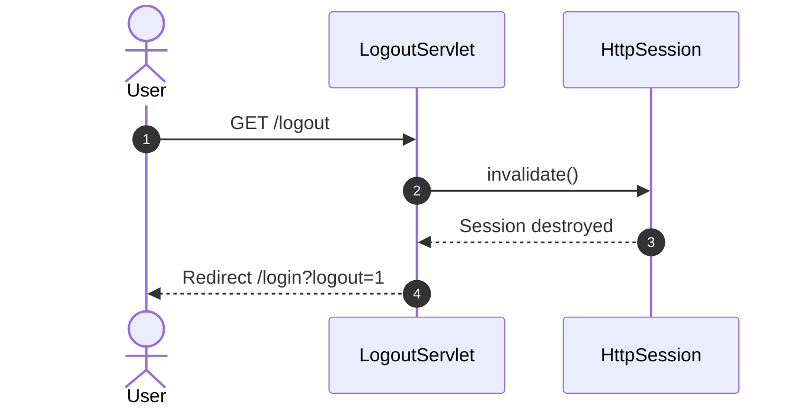
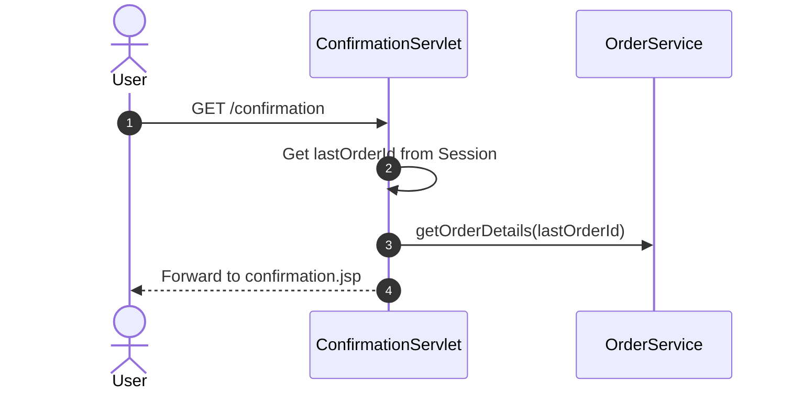
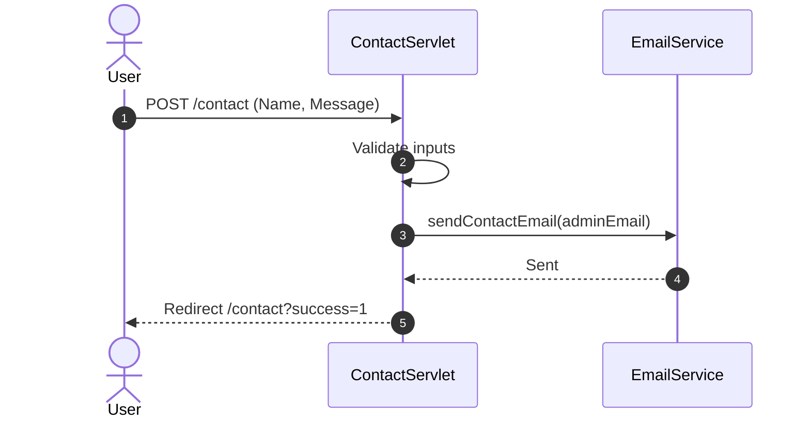
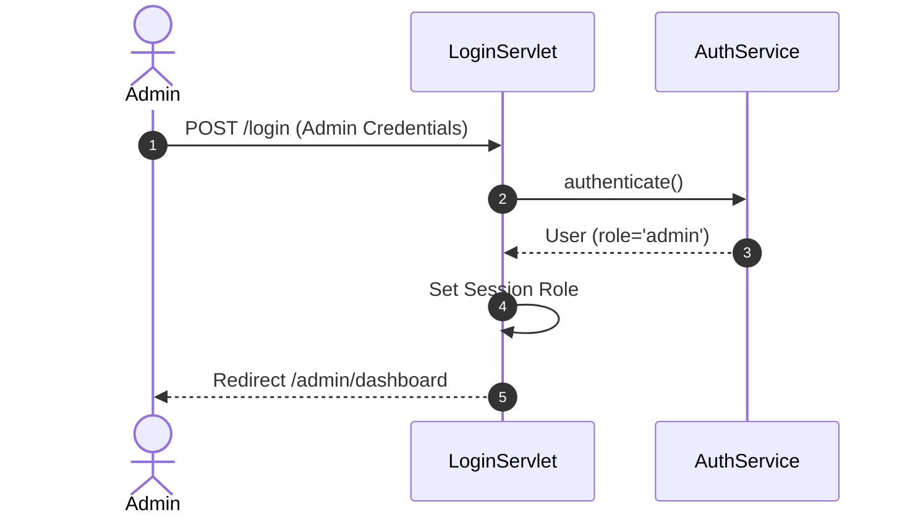

# Labas E-Commerce - Complete Sequence Diagrams

This document contains the complete set of Sequence Diagrams for the Labas E-Commerce application, covering Customer Flows, Admin Flows, and Advanced Architectural Flows.

---

## 🟢 Part 1: Customer Side

### 1. User Registration
```mermaid
sequenceDiagram
    autonumber
    actor User
    participant RegisterServlet
    participant CsrfUtil
    participant PasswordUtil
    participant ClientService
    database DB

    User->>RegisterServlet: POST /register (Form Data)
    RegisterServlet->>CsrfUtil: isValid(request)
    CsrfUtil-->>RegisterServlet: true
    RegisterServlet->>PasswordUtil: validatePolicy(password)
    RegisterServlet->>ClientService: inscrireClient(client)
    activate ClientService
    ClientService->>DB: Check if email/username exists
    ClientService->>PasswordUtil: hash(password)
    ClientService->>DB: INSERT INTO Client
    DB-->>ClientService: Success
    ClientService-->>RegisterServlet: Success Result
    deactivate ClientService
    RegisterServlet-->>User: Redirect /login?succes=1
```

### 2. User Login
```mermaid
sequenceDiagram
    autonumber
    actor User
    participant LoginServlet
    participant LoginAttemptService
    participant AuthService
    database DB

    User->>LoginServlet: POST /login
    LoginServlet->>LoginAttemptService: isBlocked(ip/email)
    LoginServlet->>AuthService: authenticate(email, password)
    AuthService->>DB: SELECT User by Email
    DB-->>AuthService: User Data
    AuthService-->>LoginServlet: User Object
    LoginServlet->>LoginAttemptService: resetAttempts()
    LoginServlet->>LoginServlet: Invalidate old session, Create new
    LoginServlet-->>User: Redirect / (if Client)
```

### 3. User Logout


### 4. Browse Catalog
```mermaid
sequenceDiagram
    autonumber
    actor User
    participant CatalogServlet
    participant CategoryService
    participant ProductService
    database DB

    User->>CatalogServlet: GET /catalog?category=X
    CatalogServlet->>CategoryService: getAllCategories()
    CategoryService->>DB: SELECT Categories
    DB-->>CategoryService: List<Category>
    CatalogServlet->>ProductService: getProductsByCategory(X)
    ProductService->>DB: SELECT Products WHERE category_id=X
    DB-->>ProductService: List<Product>
    CatalogServlet-->>User: Forward to catalog.jsp
```

### 5. View Product Details
```mermaid
sequenceDiagram
    autonumber
    actor User
    participant ProductServlet
    participant ProductService
    database DB

    User->>ProductServlet: GET /product?id=123
    ProductServlet->>ProductService: getProductById(123)
    ProductService->>DB: SELECT * FROM Product WHERE id=123
    DB-->>ProductService: Product details
    ProductServlet-->>User: Forward to product.jsp
```

### 6. Add Product to Cart
```mermaid
sequenceDiagram
    autonumber
    actor User
    participant CartServlet
    participant CartService
    database DB

    User->>CartServlet: POST /cart (action=add, id, qty)
    CartServlet->>CartService: addToCart(clientId, productId, qty)
    CartService->>DB: Check Product Stock
    CartService->>DB: UPDATE / INSERT CartItem
    DB-->>CartService: Success
    CartService->>CartService: getCartItemCount()
    CartServlet->>CartServlet: Update Session Attribute
    CartServlet-->>User: Redirect /cart
```

### 7. Remove Product from Cart
```mermaid
sequenceDiagram
    autonumber
    actor User
    participant CartServlet
    participant CartService
    database DB

    User->>CartServlet: POST /cart (action=remove, id)
    CartServlet->>CartService: removeFromCart(clientId, productId)
    CartService->>DB: DELETE FROM CartItem WHERE productId
    DB-->>CartService: Success
    CartServlet-->>User: Redirect /cart
```

### 8. Checkout Process
```mermaid
sequenceDiagram
    autonumber
    actor User
    participant CheckoutServlet
    participant OrderService
    participant EmailService
    database DB

    User->>CheckoutServlet: POST /checkout (Address Data)
    CheckoutServlet->>OrderService: checkout(userId, address)
    activate OrderService
    OrderService->>DB: INSERT Order
    OrderService->>DB: INSERT OrderItems
    OrderService->>DB: UPDATE Product Stocks
    DB-->>OrderService: Order ID
    deactivate OrderService
    CheckoutServlet->>EmailService: sendOrderConfirmation()
    CheckoutServlet->>CheckoutServlet: Reset Cart Session
    CheckoutServlet-->>User: Redirect /confirmation
```

### 9. Order Confirmation


### 10. View Order History
```mermaid
sequenceDiagram
    autonumber
    actor User
    participant OrderHistoryServlet
    participant OrderService
    database DB

    User->>OrderHistoryServlet: GET /orders
    OrderHistoryServlet->>OrderService: getOrdersByUserId(userId)
    OrderService->>DB: SELECT Orders WHERE userId
    DB-->>OrderService: List<Order>
    OrderHistoryServlet-->>User: Forward to history.jsp
```

### 11. Update Profile
```mermaid
sequenceDiagram
    autonumber
    actor User
    participant ProfileServlet
    participant ClientService
    database DB

    User->>ProfileServlet: POST /profile (Update Data)
    ProfileServlet->>ClientService: updateProfile(client)
    ClientService->>DB: UPDATE Client Details
    DB-->>ClientService: Success
    ProfileServlet->>ProfileServlet: Update Session Attributes
    ProfileServlet-->>User: Redirect /profile?success=1
```

### 12. Contact Form Submission


### 13. Upload Image/File (Avatar)
```mermaid
sequenceDiagram
    autonumber
    actor User
    participant UploadServlet
    participant FileUploadUtil
    participant ClientService
    database DB

    User->>UploadServlet: POST /upload (FilePart)
    UploadServlet->>FileUploadUtil: saveImage(part, "avatars")
    FileUploadUtil->>FileUploadUtil: Validate Extension / Size
    FileUploadUtil-->>UploadServlet: File Path/URL
    UploadServlet->>ClientService: updateAvatar(clientId, url)
    ClientService->>DB: UPDATE Client SET avatar
    UploadServlet-->>User: Redirect /profile
```

### 14. Home Page Loading
```mermaid
sequenceDiagram
    autonumber
    actor User
    participant HomeServlet
    participant ProductService
    database DB

    User->>HomeServlet: GET /
    HomeServlet->>ProductService: getFeaturedProducts()
    ProductService->>DB: SELECT Products LIMIT 8
    DB-->>ProductService: List<Product>
    HomeServlet-->>User: Forward to index.jsp
```

---

## 🔵 Part 2: Admin Side

### 15. Admin Login


### 16. View Dashboard Statistics
```mermaid
sequenceDiagram
    autonumber
    actor Admin
    participant AdminDashboardServlet
    participant StatService
    database DB

    Admin->>AdminDashboardServlet: GET /admin/dashboard
    AdminDashboardServlet->>StatService: getDashboardStats()
    StatService->>DB: SELECT COUNT(orders), SUM(revenue)
    DB-->>StatService: Statistics Data
    AdminDashboardServlet-->>Admin: Forward to dashboard.jsp
```

### 17. Add Product
```mermaid
sequenceDiagram
    autonumber
    actor Admin
    participant AdminProductsServlet
    participant FileUploadUtil
    participant ProductService
    database DB

    Admin->>AdminProductsServlet: POST /admin/products (action=save, no ID)
    AdminProductsServlet->>FileUploadUtil: saveImage()
    AdminProductsServlet->>ProductService: addProduct(Product)
    ProductService->>DB: INSERT INTO Product
    DB-->>ProductService: Success
    AdminProductsServlet-->>Admin: Redirect /admin/products
```

### 18. Edit Product
```mermaid
sequenceDiagram
    autonumber
    actor Admin
    participant AdminProductsServlet
    participant ProductService
    database DB

    Admin->>AdminProductsServlet: POST /admin/products (action=save, ID=1)
    AdminProductsServlet->>ProductService: updateProduct(Product)
    ProductService->>DB: UPDATE Product SET details
    DB-->>ProductService: Success
    AdminProductsServlet-->>Admin: Redirect /admin/products
```

### 19. Delete Product
```mermaid
sequenceDiagram
    autonumber
    actor Admin
    participant AdminProductsServlet
    participant ProductService
    database DB

    Admin->>AdminProductsServlet: POST /admin/products (action=delete, ID=1)
    AdminProductsServlet->>ProductService: deleteProduct(1)
    ProductService->>DB: DELETE FROM Product WHERE id=1
    DB-->>ProductService: Success
    AdminProductsServlet-->>Admin: Redirect /admin/products
```

### 20. Manage Categories
```mermaid
sequenceDiagram
    autonumber
    actor Admin
    participant AdminCategoriesServlet
    participant CategoryService
    database DB

    Admin->>AdminCategoriesServlet: POST /admin/categories (action=save/delete)
    AdminCategoriesServlet->>CategoryService: saveOrDelete()
    CategoryService->>DB: Execute Query
    DB-->>CategoryService: Success
    AdminCategoriesServlet-->>Admin: Redirect /admin/categories
```

### 21. Manage Clients
```mermaid
sequenceDiagram
    autonumber
    actor Admin
    participant AdminClientsServlet
    participant ClientService
    database DB

    Admin->>AdminClientsServlet: POST /admin/clients (action=block/delete)
    AdminClientsServlet->>ClientService: updateClientStatus()
    ClientService->>DB: UPDATE Client
    AdminClientsServlet-->>Admin: Redirect /admin/clients
```

### 22. Manage Orders
```mermaid
sequenceDiagram
    autonumber
    actor Admin
    participant AdminOrdersServlet
    participant OrderService
    participant EmailService
    database DB

    Admin->>AdminOrdersServlet: POST /admin/orders (action=updateStatus)
    AdminOrdersServlet->>OrderService: updateOrderStatus()
    OrderService->>DB: UPDATE Order
    OrderService->>EmailService: sendStatusUpdateEmail()
    AdminOrdersServlet-->>Admin: Redirect /admin/orders
```

### 23. Update Settings
```mermaid
sequenceDiagram
    autonumber
    actor Admin
    participant AdminSettingsServlet
    participant SettingsService
    database DB

    Admin->>AdminSettingsServlet: POST /admin/settings
    AdminSettingsServlet->>SettingsService: saveSettings(Config)
    SettingsService->>DB: UPDATE Settings
    AdminSettingsServlet-->>Admin: Redirect /admin/settings
```

---

## 🟣 Part 3: Optional / Advanced Diagrams

### 24. Database Connection Flow
```mermaid
sequenceDiagram
    autonumber
    participant DAO
    participant DBUtil
    participant HikariCP
    database MySQL

    DAO->>DBUtil: getConnection()
    DBUtil->>HikariCP: requestConnection()
    alt Connection in Pool
        HikariCP-->>DBUtil: Return Idle Connection
    else Pool Empty
        HikariCP->>MySQL: Open New Connection
        MySQL-->>HikariCP: Connection Linked
        HikariCP-->>DBUtil: Return New Connection
    end
    DBUtil-->>DAO: Connection Object
    DAO->>DAO: Execute Query
    DAO->>DBUtil: close()
    DBUtil->>HikariCP: Return to Pool
```

### 25. Session Validation Flow
```mermaid
sequenceDiagram
    autonumber
    actor Browser
    participant Filter / Servlet
    participant HttpSession

    Browser->>Filter / Servlet: Request Protected Route
    Filter / Servlet->>HttpSession: getSession(false)
    alt Session is Null
        Filter / Servlet-->>Browser: Redirect /login
    else Session Exists
        Filter / Servlet->>HttpSession: getAttribute("userId")
        alt userId is Null
            Filter / Servlet-->>Browser: Redirect /login
        else Authenticated
            Filter / Servlet-->>Browser: Allow Request (chain.doFilter)
        end
    end
```

### 26. Authentication Authorization Flow
```mermaid
sequenceDiagram
    autonumber
    actor User
    participant SecurityFilter
    participant HttpSession

    User->>SecurityFilter: Request /admin/dashboard
    SecurityFilter->>HttpSession: getAttribute("role")
    alt Role != 'admin'
        SecurityFilter-->>User: Redirect 403 Forbidden / Home
    else Role == 'admin'
        SecurityFilter-->>User: Proceed to AdminServlet
    end
```

### 27. Cart Persistence Flow
```mermaid
sequenceDiagram
    autonumber
    participant Session
    participant CartService
    database DB

    CartService->>Session: getAttribute("clientId")
    CartService->>DB: SELECT * FROM Cart WHERE clientId
    alt Cart Exists in DB
        DB-->>CartService: DB Cart Data
    else No Cart in DB
        CartService->>DB: INSERT new Cart
        DB-->>CartService: new Cart ID
    end
    CartService->>DB: Insert/Update Cart Items
    CartService->>Session: setAttribute("cartCount", size)
```

### 28. File Upload Processing
```mermaid
sequenceDiagram
    autonumber
    participant Servlet
    participant FileUploadUtil
    participant FileSystem

    Servlet->>FileUploadUtil: saveImage(request.getPart("file"))
    FileUploadUtil->>FileUploadUtil: Check contentType (isImage)
    alt Invalid Format
        FileUploadUtil-->>Servlet: Throw Exception
    else Valid Format
        FileUploadUtil->>FileUploadUtil: Generate UUID Name
        FileUploadUtil->>FileSystem: write(/uploads/UUID.jpg)
        FileSystem-->>FileUploadUtil: Write Success
        FileUploadUtil-->>Servlet: Return "/uploads/UUID.jpg"
    end
```

### 29. Error Handling / Validation Flow
```mermaid
sequenceDiagram
    autonumber
    actor User
    participant FormServlet
    participant CsrfUtil
    participant Validation Logic

    User->>FormServlet: POST /submit
    FormServlet->>CsrfUtil: isValid(token)
    alt Token Invalid
        FormServlet-->>User: Forward to Error Page / Retry
    else Token Valid
        FormServlet->>Validation Logic: check fields
        alt Fields Empty / Bad Format
            FormServlet-->>User: request.setAttribute("error"), Forward back
        else Valid Data
            FormServlet->>FormServlet: Process Logic
            FormServlet-->>User: Redirect to Success
        end
    end
```
